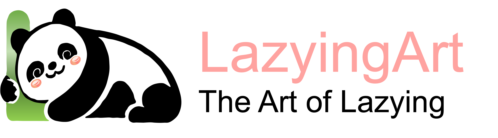

  

# Project Notes Index

Start with the maintained [website and repository directory](sites.md), [all public repositories](repositories.md), and the [LazyingArt product page](https://lazying.art/products/).

Historical notes for individual projects:

- AiSecretary — projects/AiSecretary.md
- AI‑Wearable — projects/AI-Wearable.md
- AutoPublication — projects/AutoPublication.md
- AutoPubMonitor — projects/AutoPubMonitor.md
- EchoMind — projects/EchoMind.md
- LazyEdit — projects/LazyEdit.md
- MultilingualWhisper — projects/MultilingualWhisper.md
- The Art of Lazying — projects/the-art-of-lazying.md
- VideoCaptionerWithClip — projects/VideoCaptionerWithClip.md
- VideoCaptionerWithVit — projects/VideoCaptionerWithVit.md
- WordsOrigin — projects/WordsOrigin.md
 - MicroQuant — projects/MicroQuant.md
 - QuantitativeTrading — projects/QuantitativeTrading.md
 - LightMind — projects/LightMind.md
 - LightMindWebsite — projects/LightMindWebsite.md
 - LazyingArtWebsite — projects/LazyingArtWebsite.md
 - CV — projects/CV.md
